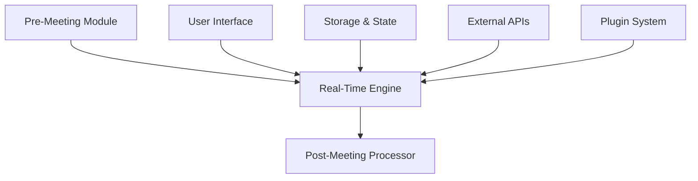
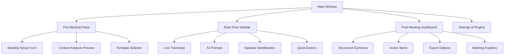
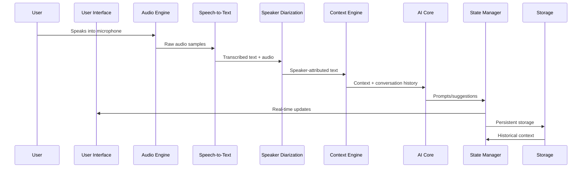
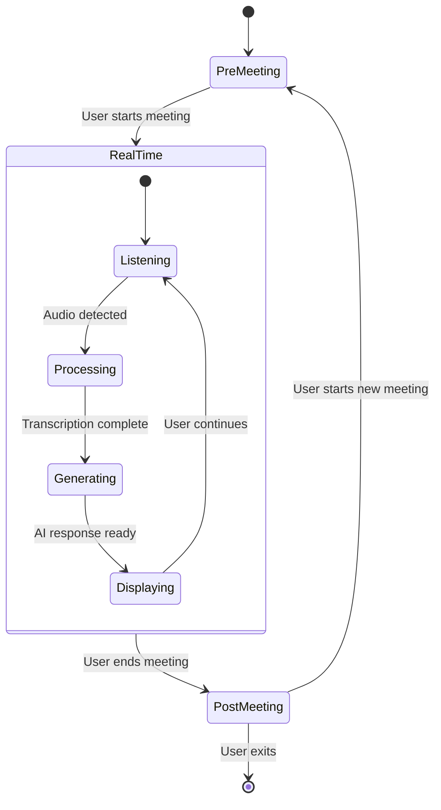
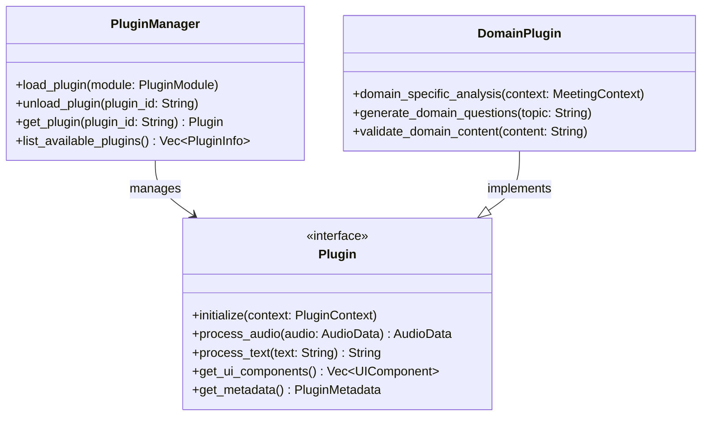
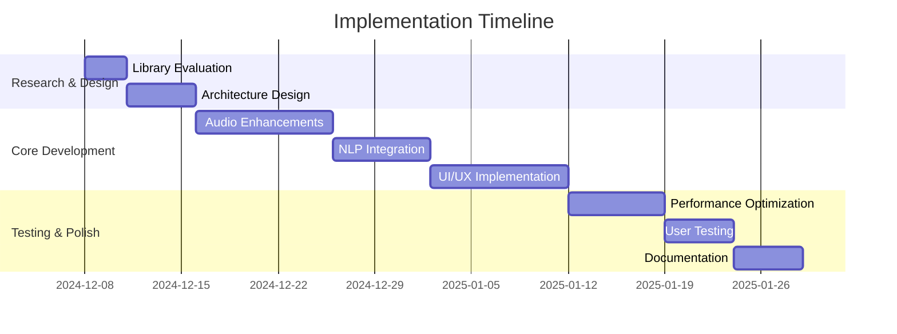

# AI-Powered Meeting & Interview Assistant - System Design

## 🎯 Overview

This document outlines the comprehensive design for transforming the existing HyperGranola AI Interview Coach into a versatile, AI-powered meeting and interview assistant with pre-meeting preparation, real-time assistance, and post-meeting documentation capabilities.

## 🔍 Current System Analysis

### Strengths of Existing Architecture

1. **Robust Foundation**: Tauri + Rust backend with React frontend
2. **Real-time Audio Processing**: Whisper-based STT with cpal audio capture
3. **AI Integration**: LLM connectivity for coaching responses
4. **Conversation Tracking**: Enhanced storage with speaker detection
5. **Export Capabilities**: Multiple format support (JSON, TXT, MD)

### Enhancement Opportunities

1. **Pre-Meeting Preparation**: Add structured input for meeting context
2. **Enhanced Audio Processing**: Speaker diarization and improved transcription
3. **Real-time Contextual Assistance**: Adaptive prompts and background info
4. **Advanced NLP**: Better question detection and topic analysis
5. **Post-Meeting Automation**: Structured summaries and action items
6. **UI/UX Improvements**: Intuitive meeting-focused interface
7. **Extensibility**: Plugin architecture for domain-specific use cases

## 🏗️ System Architecture

### High-Level Component Diagram



### Detailed Architecture Components

#### 1. Pre-Meeting Preparation Module
- **Meeting Context Input**: Structured forms for topic, participants, goals
- **Context Analysis Engine**: NLP-based topic extraction and preparation
- **Template Generator**: Domain-specific question banks and talking points
- **Integration Hub**: Calendar/API connections for automatic context import

#### 2. Real-Time Meeting Engine
- **Enhanced Audio Pipeline**: Multi-channel processing with speaker diarization
- **Contextual AI Core**: Real-time transcription + context-aware prompting
- **Adaptive UI Layer**: Non-intrusive sidebar/pop-up interface
- **State Synchronizer**: Cross-component data flow management

#### 3. Post-Meeting Processor
- **Structured Summarizer**: Action items, decisions, open questions extraction
- **Document Generator**: Multiple format output with templates
- **Integration Bridge**: Export to Notion, Slack, PDF, etc.
- **Analytics Dashboard**: Meeting metrics and participation analysis

#### 4. Cross-Cutting Services
- **Unified State Management**: Tokio-based async coordination
- **Plugin Architecture**: Domain-specific module loading
- **Privacy Layer**: Data handling and offline mode support
- **Performance Monitor**: Resource optimization and throttling

## 🔧 Library Selection & Rationale

### Audio Processing & Transcription

| Library | Purpose | Selection Rationale |
|---------|---------|---------------------|
| **[whisper-rs](https://github.com/tazz4843/whisper-rs)** | Core transcription | Already integrated, excellent performance, local processing |
| **[pyannote-rs](https://github.com/thewh1teagle/pyannote-rs)** | Speaker diarization | High accuracy, Rust implementation, real-time capable |
| **[rubato](https://github.com/henquist/rubato)** | Audio resampling | SIMD acceleration, chunk processing, real-time suitable |
| **[cpal](https://github.com/RustAudio/cpal)** | Cross-platform audio I/O | Already integrated, reliable, mature |

### NLP & Context Handling

| Library | Purpose | Selection Rationale |
|---------|---------|---------------------|
| **[llm](https://github.com/graniet/llm)** | Unified LLM API | Multi-backend support, Rust-native, async-friendly |
| **[ropey](https://github.com/cessu/ropey)** | Text processing | Efficient large text handling, Unicode-aware operations |
| **[textwrap](https://github.com/mgeisler/textwrap)** | Text formatting | Mature, Unicode support, emoji handling |
| **[rust-genai](https://github.com/jeremychone/rust-genai)** | Multi-provider AI | Unified API for OpenAI, Anthropic, Gemini, etc. |

### UI/UX Framework

| Library | Purpose | Selection Rationale |
|---------|---------|---------------------|
| **[Tauri](https://tauri.app/)** | Core framework | Already integrated, cross-platform, web tech compatible |
| **[Iced](https://github.com/iced-rs/iced)** | Native UI components | Cross-platform, Elm-inspired, good for sidebars |
| **[AccessKit](https://github.com/AccessKit/accesskit)** | Accessibility | Cross-platform a11y, screen reader support |
| **[Notify Rust](https://github.com/hoodie/notify-rust)** | Notifications | Native desktop notifications, cross-platform |

### State Management & Utilities

| Library | Purpose | Selection Rationale |
|---------|---------|---------------------|
| **[tokio](https://tokio.rs/)** | Async runtime | Already used, robust, ecosystem support |
| **[serde](https://serde.rs/)** | Serialization | Already used, comprehensive, performant |
| **[parking_lot](https://github.com/Amanieu/parking_lot)** | Synchronization | Faster than std::sync, deadlock-resistant |
| **[tracing](https://tokio.rs/tracing)** | Observability | Async-aware, structured logging |

## 🎨 Enhanced UI/UX Design

### Meeting-Centric Interface Components



### Key UI Features

1. **Pre-Meeting Setup** (`< 30 seconds`)
   - Quick input form with smart defaults
   - One-click template selection
   - Visual context preview

2. **Real-Time Interface**
   - Collapsible sidebar with adaptive prompts
   - Non-intrusive whisper mode (small overlay)
   - Keyboard shortcuts for quick actions
   - Customizable font size/contrast

3. **Post-Meeting Dashboard**
   - Structured summary with timestamps
   - Action item checklist
   - Speaker participation metrics
   - One-click export options

## 🔄 Data Flow Architecture

### Real-Time Processing Pipeline



### State Management Flow



## 📋 Technical Specifications

### 1. Pre-Meeting Preparation System

**Requirements:**
- Input validation and smart defaults
- Context analysis with NLP
- Template-based question generation
- Calendar integration (optional)

**Implementation:**
```rust
// Example: Meeting context struct
struct MeetingContext {
    topic: String,
    participants: Vec<Participant>,
    goals: Vec<String>,
    domain: MeetingDomain, // Technical, Sales, Medical, etc.
    duration_estimate: Duration,
    pre_generated_questions: Vec<String>,
    background_info: HashMap<String, String>,
}
```

### 2. Enhanced Real-Time Engine

**Requirements:**
- Multi-speaker diarization
- Context-aware prompting
- Adaptive UI updates
- Performance optimization

**Implementation:**
```rust
// Enhanced STT with diarization
async fn process_audio_with_diarization(
    audio_samples: &[f32],
    context: &MeetingContext
) -> Result<Vec<SpeakerAttributedText>, ProcessingError> {
    // 1. Transcribe with whisper-rs
    // 2. Diarize with pyannote-rs
    // 3. Contextual analysis
    // 4. Generate adaptive prompts
}
```

### 3. Post-Meeting Documentation

**Requirements:**
- Structured summary generation
- Action item extraction
- Multiple export formats
- Integration capabilities

**Implementation:**
```rust
// Structured meeting minutes
struct MeetingMinutes {
    metadata: MeetingMetadata,
    transcript: Vec<SpeakerAttributedText>,
    summary: String,
    action_items: Vec<ActionItem>,
    decisions: Vec<Decision>,
    open_questions: Vec<String>,
    participation_metrics: ParticipationStats,
    timestamps: HashMap<String, Duration>,
}
```

## 🚀 Implementation Roadmap

### Phase 1: Core Enhancement (2-3 weeks)
1. **Pre-Meeting Module** - Basic context input and templates
2. **Enhanced Audio Pipeline** - Speaker diarization integration
3. **Real-Time UI Updates** - Sidebar and whisper mode
4. **Basic Post-Meeting Export** - Structured summaries

### Phase 2: Advanced Features (3-4 weeks)
1. **Context-Aware AI Prompts** - Adaptive suggestion engine
2. **Plugin Architecture** - Domain-specific module support
3. **Advanced Export Options** - Notion/Slack integration
4. **Performance Optimization** - Resource management

### Phase 3: Polish & Extensibility (2 weeks)
1. **Accessibility Enhancements** - Full a11y compliance
2. **Comprehensive Testing** - Edge case handling
3. **Documentation & Examples** - Plugin development guide
4. **User Onboarding** - Tutorials and templates

## 📊 Performance Considerations

### Optimization Strategies

1. **Audio Processing**:
   - Chunked processing with Rubato resampling
   - Parallel transcription pipelines
   - Adaptive quality based on system resources

2. **State Management**:
   - Debounced UI updates (500ms)
   - Context compression for large meetings
   - Memory-efficient data structures

3. **AI Integration**:
   - Local fallback models
   - Request batching where possible
   - Caching frequent responses

### Resource Targets

| Component | Memory Target | CPU Target | Latency Target |
|-----------|---------------|------------|-----------------|
| Audio Processing | < 150MB | < 30% | < 500ms |
| Diarization | < 100MB | < 20% | < 300ms |
| AI Prompts | < 50MB | < 15% | < 800ms |
| UI Updates | < 30MB | < 10% | < 200ms |

## 🔒 Privacy & Security

### Data Handling Policies

1. **Local-First Approach**:
   - All processing local by default
   - Clear opt-in for cloud features
   - Data encryption at rest

2. **User Control**:
   - Granular permission settings
   - Meeting data auto-deletion options
   - Export/import for data portability

3. **Compliance**:
   - GDPR-ready architecture
   - Accessibility standards compliance
   - Regular security audits

## 🧩 Extensibility Architecture

### Plugin System Design



### Example Plugin Types

1. **Technical Interview Plugin**:
   - Code challenge integration
   - Technical question banks
   - Syntax highlighting in transcripts

2. **Sales Call Plugin**:
   - Objection handling prompts
   - Deal stage tracking
   - CRM integration hooks

3. **Medical Consultation Plugin**:
   - HIPAA-compliant modes
   - Medical terminology support
   - Structured SOAP note generation

## 📁 File Structure Enhancements

```
src/
├── core/                  # Core application logic
│   ├── audio/             # Enhanced audio processing
│   ├── nlp/               # Context analysis
│   ├── ai/                # LLM integration
│   └── state/             # State management
├── plugins/               # Plugin system
│   ├── manager.rs         # Plugin loader
│   └── examples/          # Example plugins
├── ui/                   # Enhanced UI components
│   ├── pre_meeting/       # Setup interface
│   ├── realtime/          # Live meeting UI
│   └── post_meeting/      # Documentation UI
└── integration/           # External service connectors
```

## 🎯 Success Metrics

### User Experience Targets

1. **Pre-Meeting Setup**: < 30 seconds for full configuration
2. **Real-Time Responsiveness**: < 1s latency for prompts
3. **Post-Meeting Export**: < 5 seconds for full documentation
4. **Learning Curve**: < 2 minutes for basic proficiency

### Technical Quality Metrics

1. **Test Coverage**: > 85% unit test coverage
2. **Performance**: < 500MB memory usage for 1-hour meeting
3. **Reliability**: < 1% error rate in transcription
4. **Accessibility**: WCAG 2.1 AA compliance

## 🚀 Migration Path from Current System

### Step-by-Step Enhancement

1. **Foundation Layer**:
   - Integrate selected libraries
   - Enhance existing audio pipeline
   - Implement basic plugin architecture

2. **Feature Layer**:
   - Add pre-meeting context input
   - Implement speaker diarization
   - Build structured summary generation

3. **Polish Layer**:
   - UI/UX refinements
   - Performance optimization
   - Comprehensive testing

4. **Extension Layer**:
   - Domain-specific plugins
   - Advanced integrations
   - User customization options

## 📝 Implementation Recommendations

### Best Practices

1. **Incremental Integration**:
   - Start with core audio enhancements
   - Gradually add NLP capabilities
   - Finally implement UI improvements

2. **Performance Monitoring**:
   - Continuous profiling
   - User feedback integration
   - Adaptive quality settings

3. **Backward Compatibility**:
   - Maintain existing API contracts
   - Graceful degradation for optional features
   - Clear version migration paths

### Development Workflow



## 🔮 Future Enhancements

### Potential Additions

1. **Advanced NLP**:
   - Voice/speaker recognition
   - Emotion detection
   - Multilingual support

2. **Collaboration Features**:
   - Real-time multi-user editing
   - Shared meeting templates
   - Team analytics dashboard

3. **Advanced Integrations**:
   - Calendar auto-scheduling
   - CRM deep integration
   - Knowledge base connectivity

4. **AI Improvements**:
   - Custom model fine-tuning
   - Adaptive learning from user patterns
   - Predictive meeting outcomes

## 📋 Library Selection Summary

### Final Recommendations

| Category | Primary Library | Alternatives | Decision Factors |
|----------|-----------------|--------------|------------------|
| **Audio Processing** | whisper-rs + pyannote-rs | parakeet-rs, whisperlivekit | Accuracy, Rust-native, real-time |
| **NLP/Text** | llm + ropey | rust-genai, textwrap | Unified API, performance, features |
| **UI Framework** | Tauri + Iced | Dioxus, Vizia | Existing integration, cross-platform |
| **State Management** | tokio + parking_lot | async-std, std::sync | Performance, ecosystem |
| **Serialization** | serde | bincode, rmp-serde | Existing use, comprehensive |

This design provides a comprehensive blueprint for transforming the existing AI Interview Coach into a versatile meeting assistant while maintaining the existing strengths and adding the requested functionality in a structured, performant, and extensible manner.