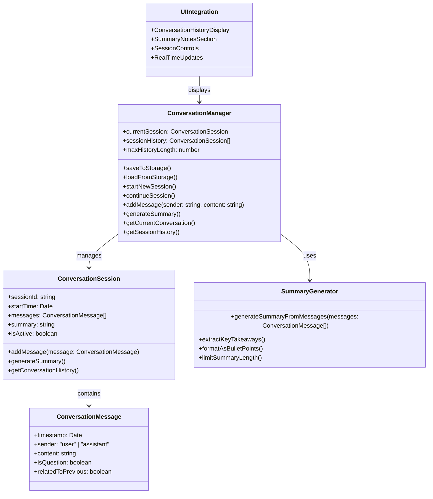
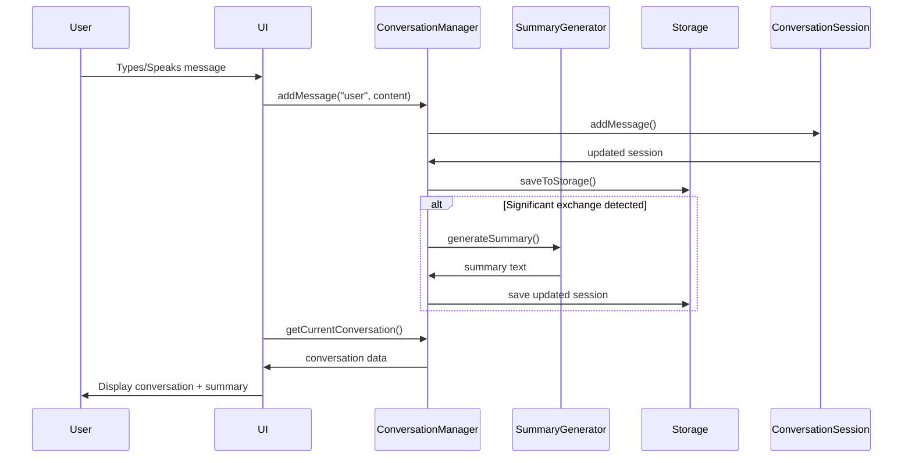

# Conversation Tracking & Summarization System Architecture

## System Overview

This document outlines the architecture for implementing conversation tracking with summarization capabilities in the existing application.

## Current System Analysis

From the codebase analysis, the current system:
- Uses React frontend with TypeScript
- Has Tauri backend (currently having issues, focusing on web mode)
- Processes transcripts and provides AI coaching responses
- Uses localStorage for some state management
- Has speech recognition capabilities
- Displays live transcript, search results, and coach responses

## Proposed Architecture



## Data Flow



## Implementation Plan

### 1. Data Model Design

**ConversationMessage Interface:**
```typescript
interface ConversationMessage {
  id: string;
  timestamp: Date;
  sender: 'user' | 'assistant';
  content: string;
  isQuestion: boolean;
  relatedToPrevious?: string; // ID of related message
}
```

**ConversationSession Interface:**
```typescript
interface ConversationSession {
  sessionId: string;
  startTime: Date;
  endTime?: Date;
  messages: ConversationMessage[];
  summary: string;
  isActive: boolean;
  title?: string; // Auto-generated from first few messages
}
```

### 2. Storage Strategy

**localStorage Structure:**
```typescript
interface ConversationStorage {
  currentSessionId: string | null;
  sessions: Record<string, ConversationSession>;
  version: string;
}
```

### 3. Core Components

**ConversationManager Class:**
- Manages active session and history
- Handles session creation/resumption
- Coordinates storage operations
- Triggers summary generation

**SummaryGenerator Service:**
- Analyzes conversation patterns
- Extracts key questions and answers
- Generates concise bullet-point summaries
- Limits summary to most relevant information

### 4. UI Integration Points

**New UI Components:**
1. **Session Controls**: New/Continue session buttons
2. **Conversation History Panel**: Scrollable message history
3. **Summary Notes Section**: Fixed position at bottom
4. **Message Context Indicators**: Visual cues for related messages

### 5. Summary Generation Algorithm

**Key Features:**
- Identifies question/answer pairs
- Detects topic changes
- Extracts action items and decisions
- Maintains speaker context
- Limits to 3-5 most important points
- Updates after significant exchanges (3+ message pairs)

### 6. Performance Optimization

**Strategies:**
- Debounce summary generation
- Limit history to last 20 messages for summary
- Use efficient localStorage operations
- Implement virtual scrolling for long conversations
- Cache generated summaries

## Technical Requirements

1. **Browser Compatibility**: Chrome, Firefox, Edge, Safari
2. **Storage Limits**: Handle localStorage quotas (5MB)
3. **Performance**: Summary generation < 500ms
4. **Session Management**: Support multiple saved sessions
5. **Error Handling**: Graceful degradation on storage failures

## Next Steps

The implementation will proceed with:
1. Creating the core data models and storage layer
2. Implementing the conversation tracking logic
3. Building the summary generation service
4. Integrating with existing UI components
5. Adding session management controls
6. Testing and optimization

This architecture provides a solid foundation for the requested conversation tracking and summarization features while maintaining the existing application's quick and simple interaction model.