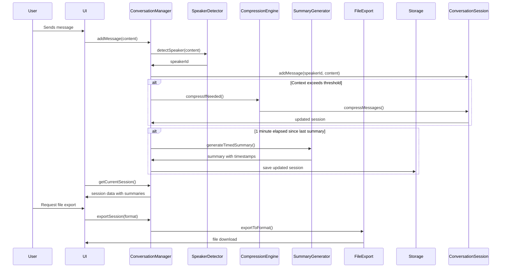

# Enhanced Conversation Tracking System - Updated Architecture

## New Requirements Incorporated

Based on user feedback, the system now includes:

1. **Multi-Speaker Support**: Automatic detection of Speaker 1, Speaker 2, etc.
2. **File Saving**: Export conversation history to files
3. **Context Compression**: Intelligent compression when context becomes excessive
4. **Timed Summarization**: Automatic summaries every minute of conversation
5. **Timestamp Support**: Include timestamps in summaries
6. **Complete History Preservation**: Keep full history while compressing for display

## Updated System Architecture

```mermaid
classDiagram
    class EnhancedConversationManager {
        +currentSession: EnhancedConversationSession
        +sessionHistory: EnhancedConversationSession[]
        +speakerRegistry: Speaker[]
        +compressionThreshold: number
        +lastSummaryTime: Date
        +saveToFile(session: EnhancedConversationSession, format: 'json'|'txt'|'md')
        +loadFromFile(file: File)
        +compressContextIfNeeded()
        +generateTimedSummary()
        +detectNewSpeaker(message: string)
        +getFormattedSummaryWithTimestamps()
    }

    class EnhancedConversationSession {
        +sessionId: string
        +startTime: Date
        +endTime: Date
        +messages: EnhancedConversationMessage[]
        +summaries: SessionSummary[]
        +speakers: Speaker[]
        +isActive: boolean
        +compressedHistory: CompressedMessage[]
        +addMessageWithSpeakerDetection(content: string)
        +compressExcessiveContext()
        +generateSummaryWithTimestamps()
        +exportToFormat(format: string)
    }

    class EnhancedConversationMessage {
        +id: string
        +timestamp: Date
        +speakerId: string
        +content: string
        +isQuestion: boolean
        +wordCount: number
        +sentimentScore: number
        +keywords: string[]
    }

    class Speaker {
        +speakerId: string
        +name: string
        +firstDetected: Date
        +messageCount: number
        +lastActive: Date
        +characteristics: string[]
    }

    class SessionSummary {
        +timestamp: Date
        +content: string
        +timeRange: {start: Date, end: Date}
        +keyPoints: string[]
        +speakerStats: SpeakerStats[]
    }

    class CompressedMessage {
        +timeRange: {start: Date, end: Date}
        +speakerId: string
        +summary: string
        +originalMessageIds: string[]
        +wordCount: number
    }

    class FileExportService {
        +exportToJSON(session: EnhancedConversationSession)
        +exportToText(session: EnhancedConversationSession)
        +exportToMarkdown(session: EnhancedConversationSession)
        +generateFilename(session: EnhancedConversationSession)
        +handleFileDownload(content: string, filename: string, mimeType: string)
    }

    class ContextCompressionEngine {
        +compressMessages(messages: EnhancedConversationMessage[])
        +detectRedundantContext()
        +generateCompressedSummary(messages: EnhancedConversationMessage[])
        +calculateContextImportance()
    }

    EnhancedConversationManager --> EnhancedConversationSession : manages
    EnhancedConversationSession --> EnhancedConversationMessage : contains
    EnhancedConversationSession --> SessionSummary : generates
    EnhancedConversationManager --> Speaker : tracks
    EnhancedConversationManager --> FileExportService : uses
    EnhancedConversationManager --> ContextCompressionEngine : uses
    EnhancedConversationSession --> CompressedMessage : creates
```

## Updated Data Flow with New Features



## Enhanced Data Models

### Speaker Detection Algorithm

```typescript
interface SpeakerDetectionResult {
  speakerId: string;
  confidence: number;
  characteristics: string[];
}

class SpeakerDetector {
  private speakers: Speaker[] = [];
  private currentSpeakerId: string | null = null;

  detectSpeaker(message: string): SpeakerDetectionResult {
    // Analyze message characteristics
    const characteristics = this.analyzeMessageCharacteristics(message);

    // Check against existing speakers
    if (this.currentSpeakerId) {
      const currentSpeaker = this.speakers.find(s => s.speakerId === this.currentSpeakerId);
      if (currentSpeaker) {
        const similarity = this.calculateCharacteristicSimilarity(
          currentSpeaker.characteristics,
          characteristics
        );

        if (similarity > 0.7) {
          return {
            speakerId: this.currentSpeakerId,
            confidence: similarity,
            characteristics
          };
        }
      }
    }

    // Find most similar existing speaker
    let bestMatch: {speaker: Speaker, similarity: number} | null = null;
    this.speakers.forEach(speaker => {
      const similarity = this.calculateCharacteristicSimilarity(
        speaker.characteristics,
        characteristics
      );
      if (similarity > 0.6 && (!bestMatch || similarity > bestMatch.similarity)) {
        bestMatch = {speaker, similarity};
      }
    });

    if (bestMatch) {
      this.currentSpeakerId = bestMatch.speaker.speakerId;
      return {
        speakerId: bestMatch.speaker.speakerId,
        confidence: bestMatch.similarity,
        characteristics
      };
    }

    // Create new speaker
    const newSpeakerId = `speaker_${this.speakers.length + 1}`;
    const newSpeaker: Speaker = {
      speakerId: newSpeakerId,
      name: `Speaker ${this.speakers.length + 1}`,
      firstDetected: new Date(),
      messageCount: 0,
      lastActive: new Date(),
      characteristics: characteristics
    };

    this.speakers.push(newSpeaker);
    this.currentSpeakerId = newSpeakerId;

    return {
      speakerId: newSpeakerId,
      confidence: 1.0,
      characteristics
    };
  }

  private analyzeMessageCharacteristics(message: string): string[] {
    const characteristics = [];

    // Message length and structure
    if (message.length > 200) characteristics.push('long_messages');
    if (message.split(' ').length > 30) characteristics.push('wordy');
    if (message.includes('?')) characteristics.push('asks_questions');
    if (message.split('\n').length > 1) characteristics.push('uses_paragraphs');

    // Content analysis
    if (message.toLowerCase().includes('i think')) characteristics.push('opinionated');
    if (message.toLowerCase().includes('what do you think')) characteristics.push('collaborative');
    if (message.match(/[A-Z]{2,}/)) characteristics.push('uses_acronyms');

    // Punctuation patterns
    if (message.includes('!')) characteristics.push('expressive');
    if (message.split('?').length > 2) characteristics.push('many_questions');

    return characteristics;
  }
}
```

### Context Compression Strategy

```typescript
class ContextCompressionEngine {
  private readonly COMPRESSION_THRESHOLD = 50; // messages
  private readonly COMPRESSION_RATIO = 0.3; // keep 30% of original

  compressIfNeeded(messages: EnhancedConversationMessage[]): CompressedMessage[] {
    if (messages.length <= this.COMPRESSION_THRESHOLD) {
      return []; // No compression needed
    }

    const compressed: CompressedMessage[] = [];
    const messagesToCompress = [...messages].sort((a, b) =>
      a.timestamp.getTime() - b.timestamp.getTime()
    );

    // Group messages by time periods and speakers
    let currentGroup: EnhancedConversationMessage[] = [];
    let currentSpeaker: string | null = null;
    let groupStartTime: Date | null = null;

    messagesToCompress.forEach((message, index) => {
      // Start new group if speaker changes or time gap > 2 minutes
      if (!currentSpeaker || message.speakerId !== currentSpeaker ||
          (groupStartTime && (message.timestamp.getTime() - groupStartTime.getTime()) > 120000)) {
        if (currentGroup.length > 0) {
          compressed.push(this.compressMessageGroup(currentGroup));
        }
        currentGroup = [message];
        currentSpeaker = message.speakerId;
        groupStartTime = message.timestamp;
      } else {
        currentGroup.push(message);
      }

      // Compress if we have enough messages
      if (currentGroup.length >= 5) {
        compressed.push(this.compressMessageGroup(currentGroup));
        currentGroup = [];
      }
    });

    // Add remaining messages
    if (currentGroup.length > 0) {
      compressed.push(this.compressMessageGroup(currentGroup));
    }

    return compressed;
  }

  private compressMessageGroup(messages: EnhancedConversationMessage[]): CompressedMessage {
    const startTime = messages[0].timestamp;
    const endTime = messages[messages.length - 1].timestamp;
    const speakerId = messages[0].speakerId;
    const messageIds = messages.map(m => m.id);
    const totalWords = messages.reduce((sum, m) => sum + m.wordCount, 0);

    // Generate summary of the group
    const keyMessages = this.selectKeyMessages(messages);
    const summary = keyMessages.map(m =>
      `${this.formatTime(m.timestamp)}: ${m.content.substring(0, 100)}...`
    ).join(' | ');

    return {
      timeRange: { start: startTime, end: endTime },
      speakerId,
      summary,
      originalMessageIds: messageIds,
      wordCount: totalWords
    };
  }

  private selectKeyMessages(messages: EnhancedConversationMessage[]): EnhancedConversationMessage[] {
    // Keep questions, long messages, and first/last messages
    const keyMessages: EnhancedConversationMessage[] = [];

    // Always keep first and last
    if (messages.length > 0) keyMessages.push(messages[0]);
    if (messages.length > 1) keyMessages.push(messages[messages.length - 1]);

    // Keep questions
    messages.forEach(msg => {
      if (msg.isQuestion && !keyMessages.includes(msg)) {
        keyMessages.push(msg);
      }
    });

    // Keep longer messages (top 20% by word count)
    const sortedByLength = [...messages].sort((a, b) => b.wordCount - a.wordCount);
    const topLengthMessages = sortedByLength.slice(0, Math.max(1, Math.floor(sortedByLength.length * 0.2)));

    topLengthMessages.forEach(msg => {
      if (!keyMessages.includes(msg)) {
        keyMessages.push(msg);
      }
    });

    return keyMessages.slice(0, 3); // Limit to 3 key messages per group
  }

  private formatTime(date: Date): string {
    return date.toLocaleTimeString([], { hour: '2-digit', minute: '2-digit' });
  }
}
```

### Timed Summary Generation

```typescript
class SummaryGenerator {
  private readonly SUMMARY_INTERVAL = 60000; // 1 minute
  private lastSummaryTime: Date | null = null;

  generateTimedSummaryIfNeeded(session: EnhancedConversationSession): SessionSummary | null {
    if (!this.lastSummaryTime) {
      this.lastSummaryTime = session.startTime;
      return null;
    }

    const now = new Date();
    if (now.getTime() - this.lastSummaryTime.getTime() < this.SUMMARY_INTERVAL) {
      return null;
    }

    // Generate summary for the time period
    const timeRange = {
      start: this.lastSummaryTime,
      end: now
    };

    const messagesInPeriod = session.messages.filter(msg =>
      msg.timestamp >= timeRange.start && msg.timestamp <= timeRange.end
    );

    if (messagesInPeriod.length === 0) {
      return null;
    }

    const summary = this.generateSummaryFromMessages(messagesInPeriod, timeRange);
    this.lastSummaryTime = now;

    return summary;
  }

  private generateSummaryFromMessages(
    messages: EnhancedConversationMessage[],
    timeRange: {start: Date, end: Date}
  ): SessionSummary {
    const keyPoints: string[] = [];
    const speakerStats: SpeakerStats[] = [];

    // Group by speaker
    const messagesBySpeaker = this.groupMessagesBySpeaker(messages);

    // Generate speaker stats
    Object.entries(messagesBySpeaker).forEach(([speakerId, speakerMessages]) => {
      speakerStats.push({
        speakerId,
        messageCount: speakerMessages.length,
        wordCount: speakerMessages.reduce((sum, m) => sum + m.wordCount, 0),
        questionsAsked: speakerMessages.filter(m => m.isQuestion).length
      });
    });

    // Generate key points
    messages.forEach(msg => {
      if (msg.isQuestion) {
        keyPoints.push(`Q (${this.formatTime(msg.timestamp)}): ${msg.content.substring(0, 80)}...`);
      } else if (msg.wordCount > 20) {
        keyPoints.push(`• (${this.formatTime(msg.timestamp)}) ${msg.content.substring(0, 60)}...`);
      }
    });

    // Format summary content
    const timePeriod = `${this.formatTime(timeRange.start)} - ${this.formatTime(timeRange.end)}`;
    const summaryContent = `Summary ${timePeriod}:\n\n${keyPoints.join('\n')}\n\nSpeaker Activity:\n${speakerStats.map(s => `• Speaker ${s.speakerId.split('_')[1]}: ${s.messageCount} messages, ${s.questionsAsked} questions`).join('\n')}`;

    return {
      timestamp: new Date(),
      content: summaryContent,
      timeRange,
      keyPoints,
      speakerStats
    };
  }
}
```

## File Export System

```typescript
class FileExportService {
  exportSession(session: EnhancedConversationSession, format: 'json' | 'txt' | 'md' = 'json'): void {
    let content = '';
    let filename = this.generateFilename(session);
    let mimeType = '';

    switch (format) {
      case 'json':
        content = this.exportToJSON(session);
        filename += '.json';
        mimeType = 'application/json';
        break;

      case 'txt':
        content = this.exportToText(session);
        filename += '.txt';
        mimeType = 'text/plain';
        break;

      case 'md':
        content = this.exportToMarkdown(session);
        filename += '.md';
        mimeType = 'text/markdown';
        break;
    }

    this.handleFileDownload(content, filename, mimeType);
  }

  private exportToJSON(session: EnhancedConversationSession): string {
    return JSON.stringify({
      sessionId: session.sessionId,
      startTime: session.startTime.toISOString(),
      endTime: session.endTime?.toISOString(),
      durationMinutes: session.endTime ?
        (session.endTime.getTime() - session.startTime.getTime()) / 60000 :
        (new Date().getTime() - session.startTime.getTime()) / 60000,
      speakers: session.speakers,
      messages: session.messages.map(m => ({
        ...m,
        timestamp: m.timestamp.toISOString()
      })),
      summaries: session.summaries.map(s => ({
        ...s,
        timestamp: s.timestamp.toISOString(),
        timeRange: {
          start: s.timeRange.start.toISOString(),
          end: s.timeRange.end.toISOString()
        }
      })),
      compressedHistory: session.compressedHistory
    }, null, 2);
  }

  private exportToMarkdown(session: EnhancedConversationSession): string {
    let md = `# Conversation Session - ${session.sessionId}\n\n`;
    md += `**Started:** ${session.startTime.toLocaleString()}\n`;
    md += `**Duration:** ${session.endTime ?
      `${(session.endTime.getTime() - session.startTime.getTime()) / 60000} minutes` :
      `${(new Date().getTime() - session.startTime.getTime()) / 60000} minutes (ongoing)`}\n\n`;

    // Speakers section
    md += '## Speakers\n\n';
    session.speakers.forEach(speaker => {
      md += `- **${speaker.name}**: First detected at ${speaker.firstDetected.toLocaleTimeString()}, ${speaker.messageCount} messages\n`;
    });

    // Conversation transcript
    md += '\n## Conversation Transcript\n\n';
    session.messages.forEach(msg => {
      const speaker = session.speakers.find(s => s.speakerId === msg.speakerId) || { name: 'Unknown' };
      md += `### ${this.formatTime(msg.timestamp)} - ${speaker.name}\n\n`;
      md += `${msg.content}\n\n`;
      if (msg.isQuestion) md += `_${msg.content}_\n\n`;
    });

    // Summaries
    if (session.summaries.length > 0) {
      md += '\n## Automatic Summaries\n\n';
      session.summaries.forEach(summary => {
        md += `### Summary: ${summary.timeRange.start.toLocaleTimeString()} - ${summary.timeRange.end.toLocaleTimeString()}\n\n`;
        md += `${summary.content}\n\n---\n\n`;
      });
    }

    return md;
  }

  private generateFilename(session: EnhancedConversationSession): string {
    const datePart = session.startTime.toISOString().split('T')[0];
    const timePart = session.startTime.toTimeString().split(':').slice(0, 2).join('-');
    return `conversation_${datePart}_${timePart}_${session.sessionId}`;
  }

  private handleFileDownload(content: string, filename: string, mimeType: string): void {
    const blob = new Blob([content], { type: mimeType });
    const url = URL.createObjectURL(blob);

    const a = document.createElement('a');
    a.href = url;
    a.download = filename;
    document.body.appendChild(a);
    a.click();

    setTimeout(() => {
      document.body.removeChild(a);
      URL.revokeObjectURL(url);
    }, 100);
  }
}
```

## Updated UI Requirements

### New UI Components Needed:

1. **Speaker Identification Display**: Show current speaker and switch detection
2. **File Export Controls**: Buttons for different export formats
3. **Compression Status Indicator**: Show when context is being compressed
4. **Timed Summary Notifications**: Visual indicators when new summaries are generated
5. **Speaker Statistics Panel**: Show participation metrics

### Enhanced Summary Display:

```typescript
function SummaryDisplay({ summaries }: { summaries: SessionSummary[] }) {
  return (
    <div className="enhanced-summary-section">
      <h3>Conversation Summary</h3>
      <div className="summary-timeline">
        {summaries.map((summary, index) => (
          <div key={index} className="timed-summary">
            <div className="summary-time-range">
              {summary.timeRange.start.toLocaleTimeString()} - {summary.timeRange.end.toLocaleTimeString()}
            </div>
            <div className="summary-content">
              <pre>{summary.content}</pre>
            </div>
            <div className="speaker-stats">
              {summary.speakerStats.map(stat => (
                <span key={stat.speakerId} className="speaker-stat">
                  Speaker {stat.speakerId.split('_')[1]}: {stat.messageCount} messages
                </span>
              ))}
            </div>
          </div>
        ))}
      </div>
    </div>
  );
}
```

## Implementation Roadmap

1. **Enhanced Data Models**: Update to support multi-speaker and compression
2. **Speaker Detection System**: Implement the SpeakerDetector class
3. **Context Compression Engine**: Build compression logic
4. **Timed Summary Generation**: Add 1-minute summary triggers
5. **File Export Service**: Implement multiple format support
6. **UI Enhancements**: Add speaker indicators and export controls
7. **Storage Migration**: Handle conversion from old to new format
8. **Performance Optimization**: Ensure real-time responsiveness

## Key Benefits of Enhanced System

1. **Automatic Speaker Tracking**: No manual speaker identification needed
2. **Intelligent Compression**: Maintains full history while optimizing display
3. **Rich Summaries**: Includes timestamps and speaker statistics
4. **Portable Data**: Export conversations for external use
5. **Context Preservation**: Complete history always available
6. **Presenter-Friendly**: Easy-to-scan summaries with key information

This enhanced architecture addresses all the new requirements while maintaining the original system's quick and simple interaction model.